# COMP0119 Assignment1
**Platform Information**

```text
OS: 				macOS Ventura
Processor: 			M2 Pro Simulating Intel by Rosetta
Environment:		Python 3.9.15
Python Packages:	open3d, numpy, sklearn, matplotlib
```

## Part 1

### Visualize the meshes

 I use Meshlab to visualize the meshes. Below is the image of `bunny_v2/bun000_v2.ply` and `bunny_v2/bun045_v2.ply` being shown in a common coordinate system.

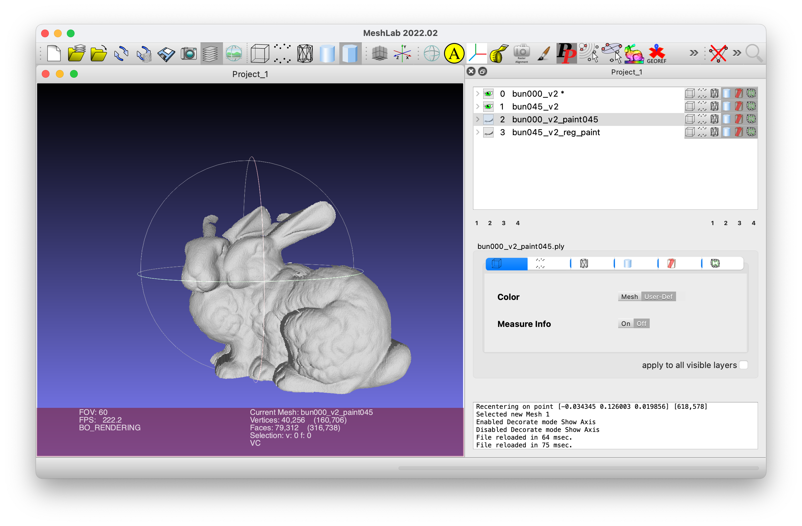

### Implementation of the ICP algorithm

I implement ICP algorithm and use it to align `bunny_v2/bun045_v2.ply` to `bunny_v2/bun000_v2.ply` . 

I also paint the meshes to mark out the overlapping and non-overlapping regions. The painted (and aligned) meshes are saved in `bunny_v2/bun000_v2_paint045.ply` (painted  `bunny_v2/bun000_v2.ply`) and `bunny_v2/bun045_v2_reg_paint.ply` (painted and aligned `bunny_v2/bun045_v2.ply`).  The colours used and their corresponding region is listed below.

|                 Colour                 |                            Region                            |
| :------------------------------------: | :----------------------------------------------------------: |
|        | Non-overlapping region in `bunny_v2/bun000_v2_paint045.ply`  |
|  |                      Overlapping region                      |
|      | Non-overlapping region in `bunny_v2/bun045_v2_reg_paint.ply` |

The result is shown below:

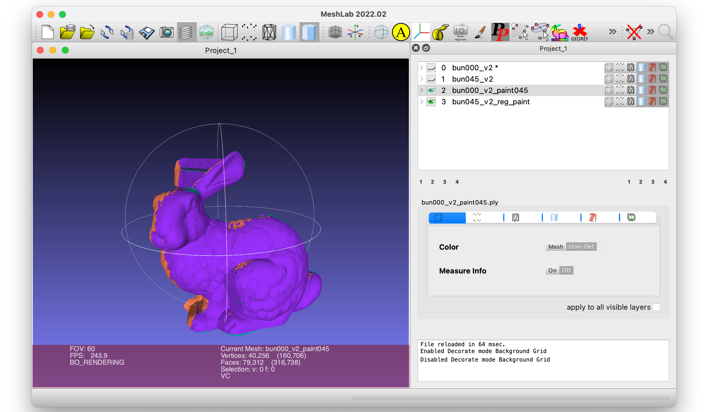


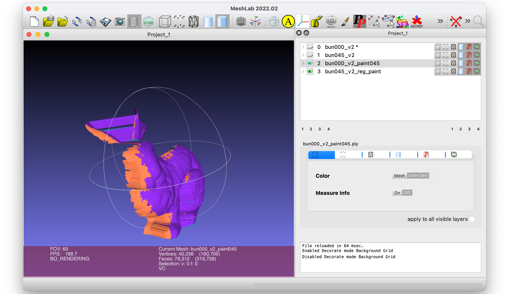

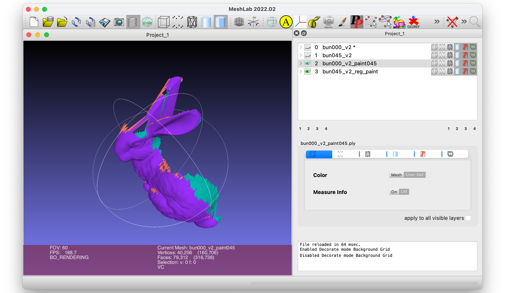

We can see that most of the regions are aligned. Most of the non-overlapping regions are because there is no corresponding vertices in another mesh. I also calculated the performance of my ICP by function in `open3d`,  which is `open3d.pipelines.registration.evaluate_registration`. It shows that $91.5\%$ of vertices in `bunny_v2/bun045_v2.ply` are got matched.

### ICP algorithm with weights

After add the weights associated with points, the objective function becomes to
$$
E(\bold{R},\bold{t}) = \sum_{i}^{n}w_i\|\bold{Rp}_i+\bold{t}-\bold{q}_i\|^2
$$
.

We can use differential to minimize formula $\text{(1)}$:
$$
\left\{
\begin{aligned}
\frac{\partial E}{\partial \bold{R}} = 0 \\ 
\frac{\partial E}{\partial \bold{t}} = 0
\end{aligned}
\right.\\
$$
.

First we solve $\frac{\partial E}{\partial \bold{t}} = 0$:
$$
\frac{\partial E}{\partial \bold{t}} = \sum_i^{n} 2w_i(\bold{Rp}_i+\bold{t}-\bold{q}_i)=0
$$
, therefore,
$$
\frac{\sum_i^{n}w_i\bold{Rp}_i}{n}+\frac{\sum_i^{n}w_i\bold{t}}{n}-\frac{\sum_i^{n}w_i\bold{q}_i}{n}=0
$$
.

If we assume
$$
\left\{
\begin{aligned}
\overline{\bold{p}} = \frac{\sum_i^{n}w_i\bold{p}_i}{n} \\ 
\overline{\bold{q}} = \frac{\sum_i^{n}w_i\bold{q}_i}{n}
\end{aligned}
\right.\\
$$
, which are in the form of weighted averages.

So that formula $\text{(4)}$ can be written as
$$
\bold{t} = \overline{\bold{q}}-\bold{R}\overline{\bold{p}}
$$
.

Since $\overline{\bold{q}}$ and $\overline{\bold{p}}$ are constants, the remaining problems are the same as the derivation done in class. So that the solution is 
$$
\left\{
\begin{aligned}
\bold{R} & = \bold{V}\begin{bmatrix}
1&0&0\\
0&1&0\\
0&0&\text{det(}\bold{VU}^{\text{T}})\\
\end{bmatrix}\bold{U}^\text{T}\\ 
\bold{t} & = \overline{\bold{q}}-\bold{R}\overline{\bold{p}}
\end{aligned}
\right.\\
$$
, where
$$
\left\{
\begin{aligned}
\overline{\bold{p}} = \frac{\sum_i^{n}w_i\bold{p}_i}{n} \\ 
\overline{\bold{q}} = \frac{\sum_i^{n}w_i\bold{q}_i}{n}
\end{aligned}
\right.\\
$$
, and 
$$
\text{SVD}(\sum_i^{n}\widetilde{\bold{p}_i}\ \widetilde{\bold{q}_i}^{\text{T}})=\bold{U\Sigma V}^{\text{T}}
$$
, where
$$
\left\{
\begin{aligned}
\widetilde{\bold{p}_i} = \bold{p}_i - \overline{\bold{p}} \\ 
\widetilde{\bold{q}_i} = \bold{q}_i - \overline{\bold{q}}
\end{aligned}
\right.\\
$$
.

<div style="page-break-after:always"></div>

## Part 2

I rotate the mesh `bunny_v2/bun000_v2.ply`  with several angels and test my implementation of the ICP algorithm on them. The relationship between fitness and the angel is shown in the plot below.

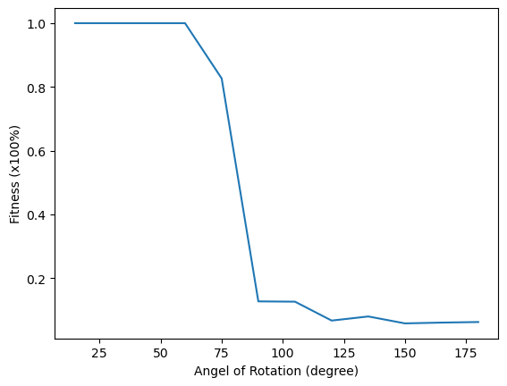

We can see that there is a huge drop in fitness when the angel of rotation is larger than $75^{\degree}$. It means if there is a big difference between the initial poses of two meshes, the ICP algorithm becomes very ineffective. It is because the method of using the nearest neighbour to find corresponding points is no longer reliable.

<div style="page-break-after:always"></div>

## Part 3

I use the side lengths of the axis-aligned bounding box as the standard to determine the variance of the noises. Assume the x-axis corresponding side length of the axis-aligned bounding box is $lx$, then set a Noise Rate ($nr$). Given a point ( $p=(x, y, z)$ ) in a mesh, after adding the noise the $x$ coordinate should be 

```
x + numpy.random.normal(0, lx*nr)
```

. The coordinates of the y-axis and z-axis are the same case as the x-axis. The relationship between fitness and the noise rate is shown in the plot below.

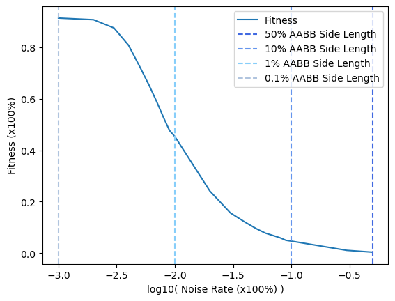

We can see when the noise rate increase to $1\%$, the fitness becomes less than $50\%$. However, it is because the noises are not taken into account when calculating fitness. Visualize the case of $1\%$ in MeshLab:

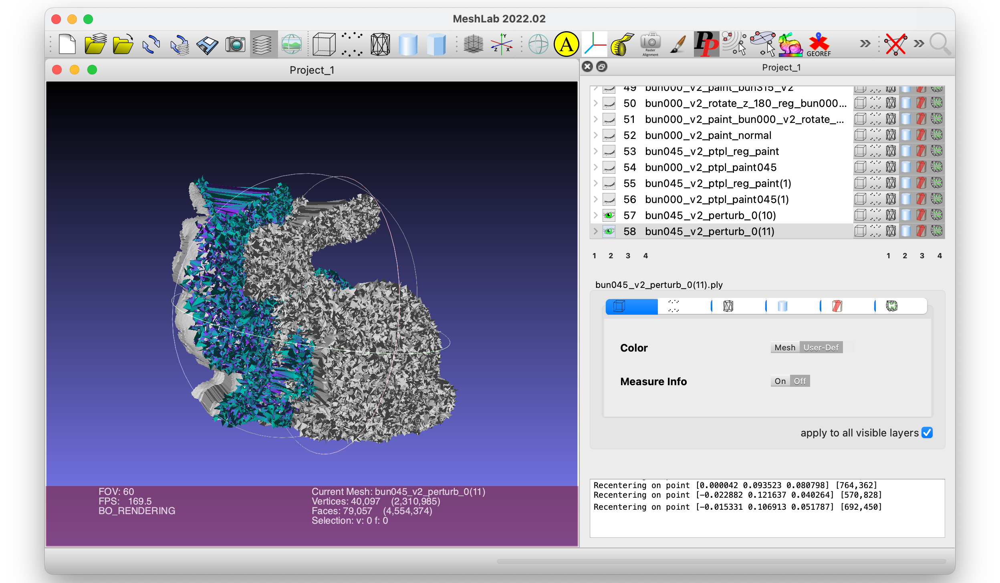

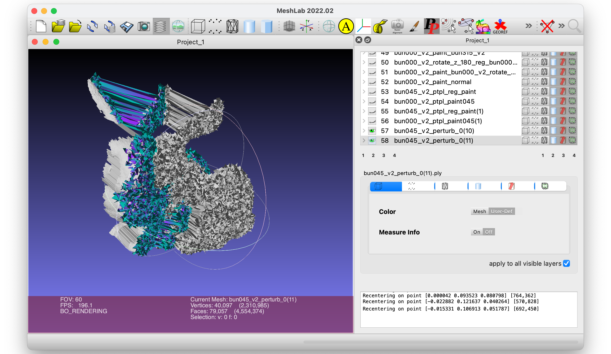

In the screenshot, the rightmost rabbit is the 'noisy rabbit ' before aligning. The coloured rabbit is the 'noisy rabbit ' after aligning. The leftmost is the target rabbit of which the most part is covered by the coloured 'noisy rabbit'.  We can see after aligning by ICP, actually, the pose of the 'noisy rabbit' is aligned with the target rabbit. The reason for low fitness is that there is a threshold when judging whether a point has a corresponding point in the target point cloud, and the addition of noise could make the distance to the potential corresponding point larger than the threshold, thus reducing the fitness. So I add one noise length to the base threshold to observe how the noise will disturb the alignment of the pose of the ICP algorithm.  The relationship between fitness considering noise and the noise rate is shown in the plot below.

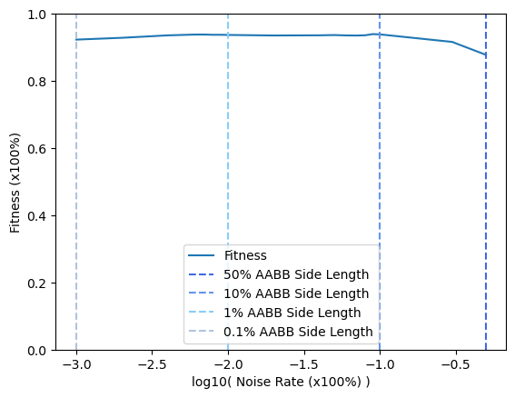

We can see that the fitness has been maintained at a high level. However, the examples that have higher noise levels (such as a noise rate of 10%) are not so informative, since it is not so possible to meet these cases in the real life. The noise rate of $1\%$ shown above is already quite noisy.

<div style="page-break-after:always"></div>

## Part 4

I test the influence of the sampling rate by aligning `bunny_v2/bun045_v2.ply` to `bunny_v2/bun000_v2.ply` with different sampling rates. The relationship between fitness, the sampling rate and the time cost of ICP  is shown in the plot below.

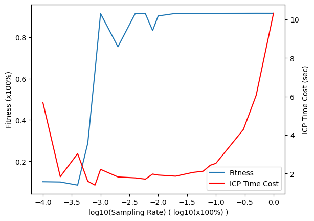

We can see that with the increase of sampling rate, the fitness increases but the ICP time cost increases too. We can also notice that when the sampling rate is low, the time cost is also high. 

When the sampling rate is high, though the performance of aligning is pretty good, the number of points to be sampled may be very large, thus making progress in finding possible corresponding points by finding the nearest neighbour cost a large amount of time. When the sampling rate is very low, not only the fitness is low, but also the time cost is quite high. The reason is that too few sampling points are likely not to represent the whole model well, unless the sample points are specifically selected, such as certain feature points.

Therefore there is a trade-off between performance and time cost. We can see from the plot that, in this case, a sampling rate of $0.1\%\textasciitilde1\%$ is fairly enough, which keeps a balance of efficiency and performance.

<div style="page-break-after:always"></div>

## Part 5

Given multiple scans and align all of them to a common global coordinate frame. I choose:

+ `bunny_v2/bun000_v2.ply`,
+ `bunny_v2/bun045_v2.ply`, 
+ `bunny_v2/bun270_v2.ply`,
+ `bunny_v2/bun315_v2.ply`,
    + `bunny_v2/bun090_v2.ply` and `bunny_v2/bun180_v2.ply` cannot align to the others by rigid transformation
+ and `bunny_v2/bun000_v2_rotate_z_180.ply` 
    + is a mesh generated in **Part 2**, which is `bunny_v2/bun045_v2.ply` rotates $180^{\degree}$.

as the multiple scans, and `bunny_v2/bun000_v2.ply` is chosen as the **base scan**. 

A simple method is choosing a scan as the base and aligning all the others to the **base scan**. But there is a problem, as discussed in **Part 2**,  ICP algorithm will be ineffective if there is a big difference between the initial poses of two meshes. In the examples I choose, `bunny_v2/bun000_v2_rotate_z_180.ply` cannot be aligned to `bunny_v2/bun000_v2.ply` due to the difference in the initial pose by my ICP. 

To solve the problem, we can make a rough alignment before using the ICP algorithm, which aims to get the initial pose of the source mesh as close as possible to the pose of the target. We can realize it with the help of **features**. Like the Harris Corner in Image Processing, we can find some specific features in the point clouds. One of the point cloud features is Point Feature Histograms (**PFH**), and it also has a more efficient version **FPFH**. We first extract feature points from the source and target point clouds, then we use these feature points to calculate a rough rigid transformation matrix between the source and target. It seems simple but finding the corresponding feature points is still a big problem. Fortunately, there already have some algorithms to do the rough alignment (or called Coarse/Global Registration) such as Sample Consensus Initial Alignment. In Python Library `open3d`, there is also a method to do the Global Registration by FPFH (feature points) and RANSAC (finding the corresponding feature points and calculating rigid transformation matrix). 

Therefore, I use `open3d` to roughly align the point clouds before using ICP. Then all the scans in this example are aligned to the **base scan** successfully. Below are the results visualized in the MeshLab.

|                 Colour                 |                 Region                  |
| :------------------------------------: | :-------------------------------------: |
|        | Non-overlapping region in **base scan** |
|  |           Overlapping region            |
|      |  Non-overlapping region in other scans  |

+ `bunny_v2/bun045_v2.ply` to `bunny_v2/bun000_v2.ply`

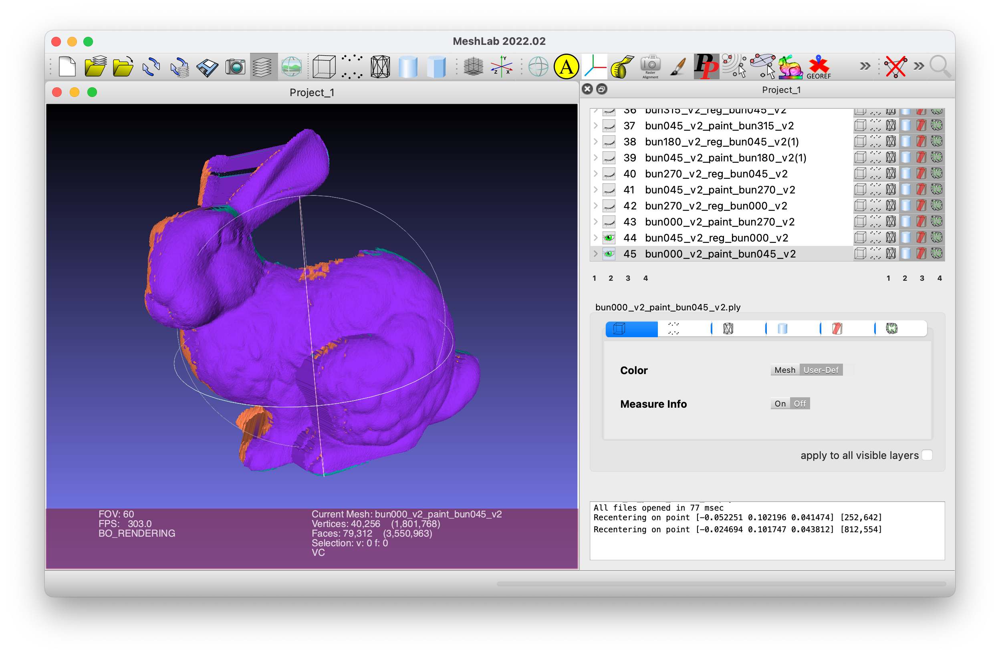

+ `bunny_v2/bun270_v2.ply` to `bunny_v2/bun000_v2.ply`

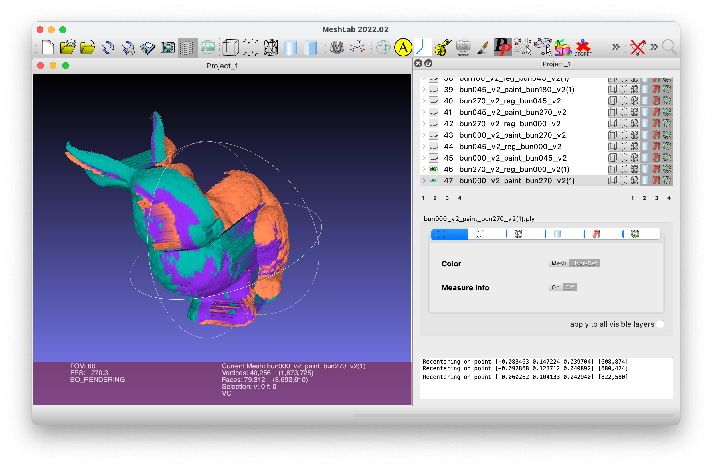

+ `bunny_v2/bun315_v2.ply` to `bunny_v2/bun000_v2.ply`


+ `bunny_v2/bun000_v2_rotate_z_180.ply`  to `bunny_v2/bun000_v2.ply`

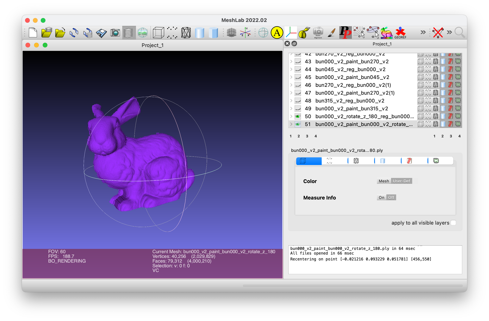

Until now, all the scans in this example can be aligned to the **base scan**. 

<div style="page-break-after:always"></div>

## Part 6

### Shade the models based on these normals

Paint `bunny_v2/bun000_v2.ply` by normals:

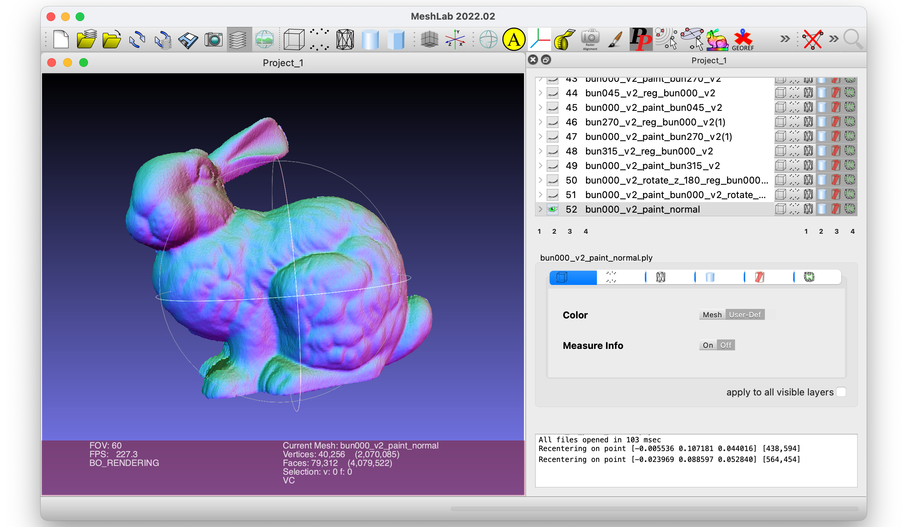


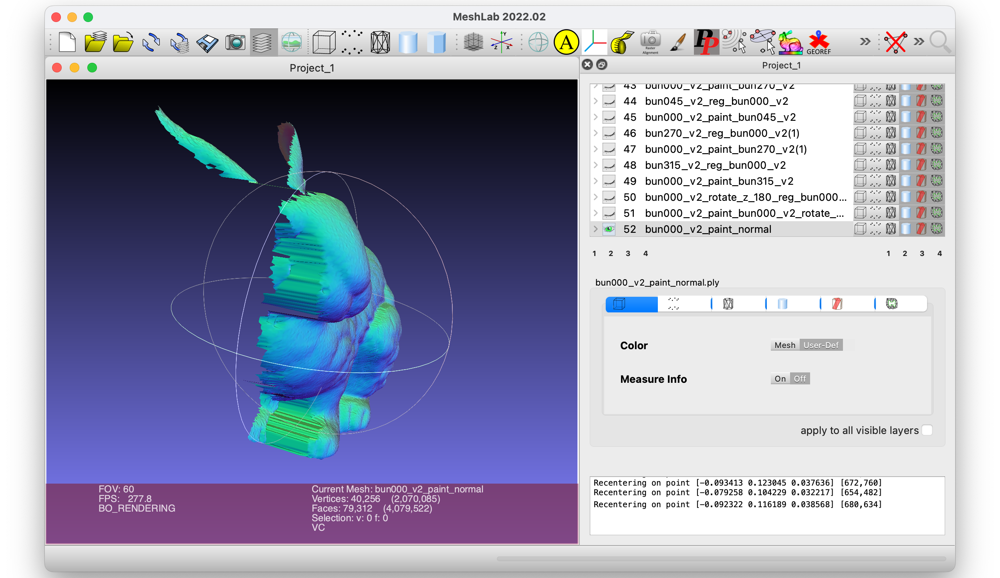

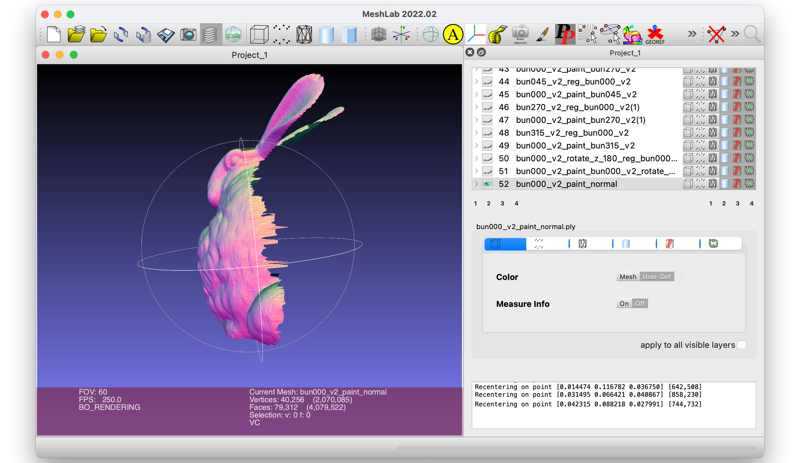


### Derivation of Point-to-Plane ICP

Objective function:
$$
E(\bold{R},\bold{t}) = \sum_{i}^{n}\|(\bold{Rp}_i+\bold{t}-\bold{q}_i)\cdot \bold{n}_i^q\|^2
$$

#### Step 1: Parameterising $\bold{R}$ and $\bold{t}$

Assume that the rotation matrix $\bold{R}$ rotates the target by $\alpha$ degree around the x-axis, $\beta$ degree around the y-axis and $\gamma$ degree around the z-axis, then $\bold{R}$ can be rewritten as:
$$
\bold{R} = \bold{R}_{\text{x}}(\alpha)\bold{R}_{\text{y}}(\beta)\bold{R}_{\text{z}}(\gamma)
$$
, where
$$
\left\{
\begin{aligned}
\bold{R}_{\text{x}}(\alpha) = \begin{bmatrix}
1&0&0\\
0&\text{cos}(\alpha)&-\text{sin}(\alpha)\\
0&\text{sin}(\alpha)&\text{cos}(\alpha)\\
\end{bmatrix}\\ 
\bold{R}_{\text{y}}(\beta) = \begin{bmatrix}
\text{cos}(\beta)&0&\text{sin}(\beta)\\
0&1&0\\
-\text{sin}(\beta)&0&\text{cos}(\beta)\\
\end{bmatrix}\\ 
\bold{R}_{\text{z}}(\gamma) = \begin{bmatrix}
\text{cos}(\gamma)&-\text{sin}(\gamma)&0\\
\text{sin}(\gamma)&\text{cos}(\gamma)&0\\
0&0&1\\
\end{bmatrix}\\ 
\end{aligned}
\right.\\
$$
.

Assume $\alpha$, $\beta$ and $\gamma$ are fairly small angels, $\text{i.e}\  \alpha,\beta,\gamma \to 0$. When $\theta \to 0$, there are $\cos(\theta)\to 1, \sin(\theta)\to \theta$ and $\theta^2\to0$. So that
$$
\left\{
\begin{aligned}
\bold{R}_{\text{x}}(\alpha) \approx \begin{bmatrix}
1&0&0\\
0&1&-\alpha\\
0&\alpha&1\\
\end{bmatrix}\\ 
\bold{R}_{\text{y}}(\beta) \approx \begin{bmatrix}
1&0&\beta\\
0&1&0\\
-\beta&0&1\\
\end{bmatrix}\\ 
\bold{R}_{\text{z}}(\gamma) \approx \begin{bmatrix}
1&-\gamma&0\\
\gamma&1&0\\
0&0&1\\
\end{bmatrix}\\ 
\end{aligned}
\right.\\
$$
.

Substituting $\text{(14)}$ into $\text{(12)}$:
$$
\bold{R} \approx \begin{bmatrix}
1&-\gamma&\beta\\
\gamma&1&-\alpha\\
-\beta&\alpha&1\\
\end{bmatrix}
$$
.

For translation $\bold{t}$, assume
$$
\bold{t} = \begin{bmatrix}
\text{t}_{\text{x}}\\
\text{t}_{\text{y}}\\
\text{t}_{\text{z}}\\
\end{bmatrix}
$$

#### Step 2: Converting to a least squares problem

First, we assume
$$
\left\{
\begin{aligned}

\bold{p}_{i} & = \begin{bmatrix}
\text{p}_i^x&\text{p}_i^y&\text{p}_i^z\\
\end{bmatrix}^\text{T}\\ 

\bold{q}_{i} & = \begin{bmatrix}
\text{q}_i^x&\text{q}_i^y&\text{q}_i^z\\
\end{bmatrix}^\text{T}\\

\bold{n}_{i}^q & = \begin{bmatrix}
\text{n}_i^x&\text{n}_i^y&\text{n}_i^z\\
\end{bmatrix}^\text{T}
 
\end{aligned}
\right.\\
$$


, then we substitute $\text{(15)},\text{(16)}$ and $\text{17}$ into $(\bold{Rp}_i+\bold{t}-\bold{q}_i)\cdot \bold{n}_i^q$ :
$$
\begin{aligned}

&(\bold{Rp}_i+\bold{t}-\bold{q}_i)\cdot \bold{n}_i^q \\
&=
(\begin{bmatrix}
1&-\gamma&\beta\\
\gamma&1&-\alpha\\
-\beta&\alpha&1\\
\end{bmatrix}

\begin{bmatrix}
\text{p}_i^x \\
\text{p}_i^y \\
\text{p}_i^z \\
\end{bmatrix}
+
\begin{bmatrix}
\text{t}_{\text{x}}\\
\text{t}_{\text{y}}\\
\text{t}_{\text{z}}\\
\end{bmatrix}
-
\begin{bmatrix}
\text{q}_i^x \\
\text{q}_i^y \\
\text{q}_i^z \\
\end{bmatrix}
)
\cdot 
\begin{bmatrix}
\text{n}_i^x \\
\text{n}_i^y \\
\text{n}_i^z \\
\end{bmatrix} \\
&=(\text{n}_i^z\text{p}_i^y-\text{n}_i^y\text{p}_i^z)\alpha
+(\text{n}_i^x\text{p}_i^z-\text{n}_i^z\text{p}_i^x)\beta
+(\text{n}_i^y\text{p}_i^x-\text{n}_i^x\text{p}_i^y)\gamma
+(\text{n}_i^x)\text{t}_{\text{x}}
+(\text{n}_i^y)\text{t}_{\text{y}}
+(\text{n}_i^z)\text{t}_{\text{z}}\\
&\ \ \ \ \ -(\text{n}_i^x\text{q}_i^x+\text{n}_i^y\text{q}_i^y+\text{n}_i^z\text{q}_i^z
-\text{n}_i^x\text{p}_i^x-\text{n}_i^y\text{p}_i^y-\text{n}_i^z\text{p}_i^z)

\end{aligned}
$$

.

Assume
$$
\left\{
\begin{aligned}

\bold{a}_i & = \begin{bmatrix}
\text{n}_i^z\text{p}_i^y-\text{n}_i^y\text{p}_i^z&
\text{n}_i^x\text{p}_i^z-\text{n}_i^z\text{p}_i^x&
\text{n}_i^y\text{p}_i^x-\text{n}_i^x\text{p}_i^y&
\text{n}_i^x&
\text{n}_i^y&
\text{n}_i^z\\
\end{bmatrix}^\text{T}\\

\text{b}_i & = \text{n}_i^x\text{q}_i^x+\text{n}_i^y\text{q}_i^y+\text{n}_i^z\text{q}_i^z
-\text{n}_i^x\text{p}_i^x-\text{n}_i^y\text{p}_i^y-\text{n}_i^z\text{p}_i^z\\

\text{x} & = \begin{bmatrix}
\alpha&
\beta&
\gamma&
\text{t}_{\text{x}}&
\text{t}_{\text{y}}&
\text{t}_{\text{z}}\\
\end{bmatrix}^\text{T}

\end{aligned}
\right.\\
$$

, so that
$$
\begin{aligned}

E(\bold{R},\bold{t}) = & \sum_{i}^{n}\|(\bold{Rp}_i+\bold{t}-\bold{q}_i)\cdot \bold{n}_i^q\|^2 \\
= & \sum_{i}^{n}[(\bold{Rp}_i+\bold{t}-\bold{q}_i)\cdot \bold{n}_i^q]^\text{T}[(\bold{Rp}_i+\bold{t}-\bold{q}_i)\cdot \bold{n}_i^q] \\
= & \|\bold{A}\text{x}-\bold{b}\|^2

\end{aligned}
$$
, where
$$
\left\{
\begin{aligned}

\bold{A} & = \begin{bmatrix}
\bold{a}_0&
\bold{a}_1&
\dots&
\bold{a}_i&
\dots&
\bold{a}_{n-1}\\
\end{bmatrix}^\text{T}\\

\bold{b} & = \begin{bmatrix}
\text{b}_0&
\text{b}_1&
\dots&
\text{b}_i&
\dots&
\text{b}_{n-1}\\
\end{bmatrix}^\text{T}

\end{aligned}
\right.\\
$$
.

Until now, the origin problem is converted to a least squares problem $E(\bold{R},\bold{t}) = \|\bold{A}\text{x}-\bold{b}\|^2$.

#### Step 3: Solve the least squares problem

Use $\text{SVD}$ to solve the least squares problem:
$$
\text{SVD}(\bold{A})=\bold{U}\bold{\Sigma}\bold{V}^{\text{T}}
$$

$$
\bold{A}^{\dagger}=\bold{V}\bold{\Sigma}^{\dagger}\bold{U}^{\text{T}}
$$

, where $\bold{\Sigma}^{\dagger}$ is the inverse or  pseudoinverse of $\bold{\Sigma}$.

So that,
$$
\text{x}=\bold{A}^{\dagger}\bold{b}
$$

#### Step 4: Calculate $\bold{R}$ and $\bold{t}$ from $\text{x}$

$\bold{t}$ can be extracted from $\text{x}$ directly by $\text{(16)}$.

After getting $\alpha, \beta$ and $\gamma$ from $\text{x}$, we cannot calculate $\bold{R}$ by $(15)$ which is only an approximation of $\bold{R}$. We should calculate $\bold{R}$ by $(12)$ and $(14)$.


### Visualize the result of Point-to-Plane ICP

I align `bunny_v2/bun045_v2.ply` to `bunny_v2/bun000_v2.ply` by the new Point-to-Plane ICP, below is the screenshot of MeshLab.

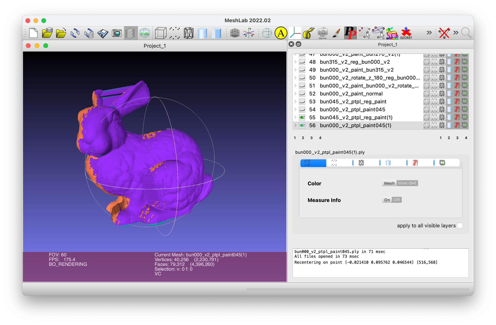

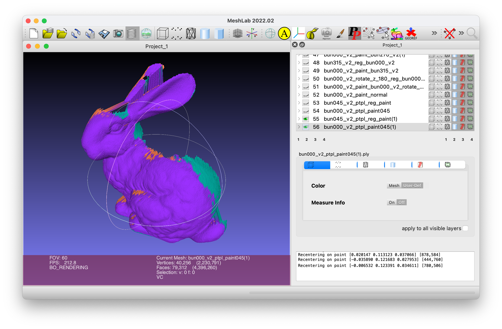

The performance is as well as the point-to-point version, but the convergence speed is slower. The possible reason may be the method using an approximation, which assumes that in each iteration we only rotate the point cloud with a quite small angle. This method will be effective when the initial pose of the source is close to the target. Conversely, it may take longer to converge.
